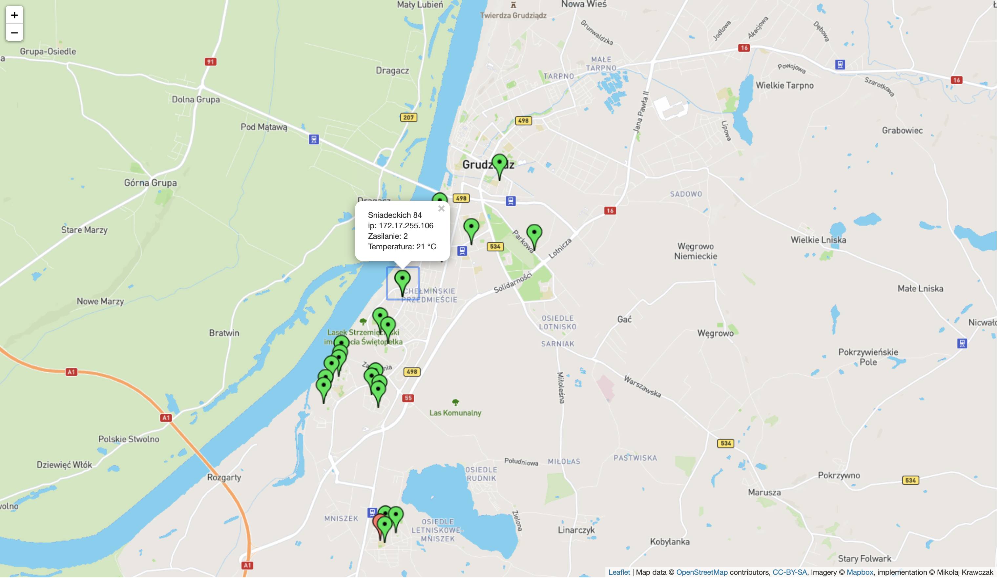
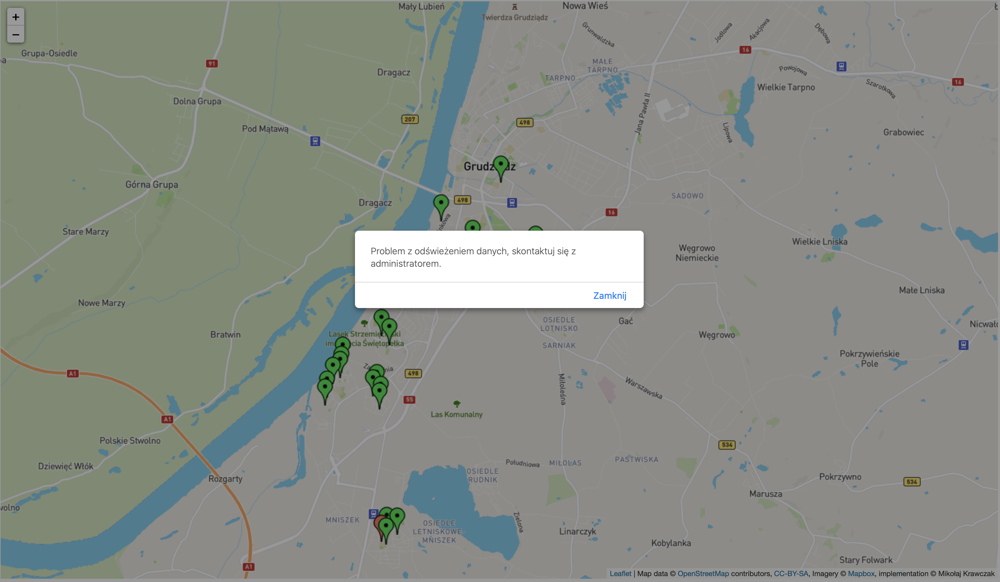

> The application has been designed as a tool to track on the map and get information about devices in local company.  

## Table of contents
* [General info](#general-info)
* [Features](#features)
* [Technologies](#technologies)
* [Status](#status)
* [Inspiration](#inspiration)

## General info
> Application for local Grudziądz TV. App tracks theirs devices on the map and show informations about them. App retrieves information in real time. Here you can see app with examples data in json.  
## Features
### MainPage
 
>  Page where user can track and get information about devices.  

### MainView
 
> If user have problem with Internet connection or if API is not available app will show message like on screenshot.

## Technologies
* Java SE 14
* Spring boot
* REST API
* Docker
* Tomcat
* Maven 
* Freemarker
* Bootstrap 
* HTML5, CSS3, JS
* jQuery, AJAX
*leaflet map

## Status
Project is: _finished_.

## Inspiration
for the needs of the company 
